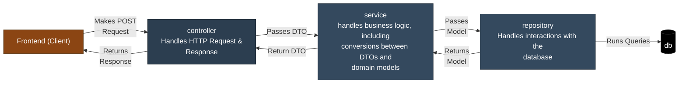
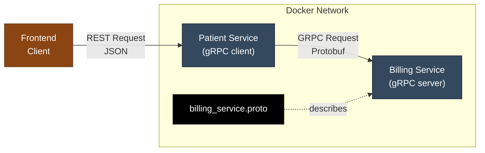
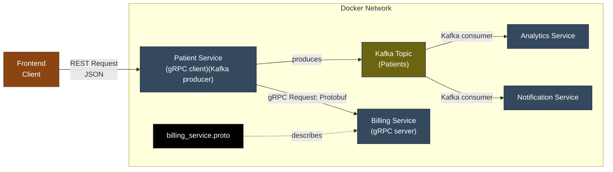
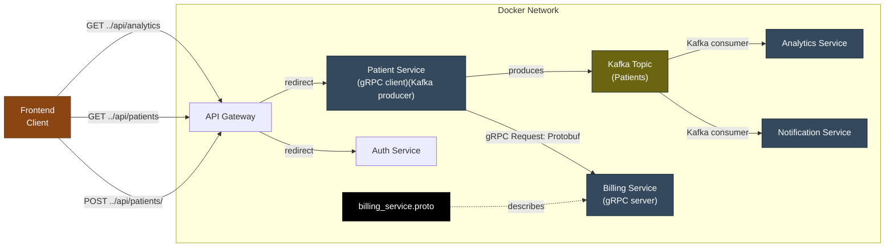
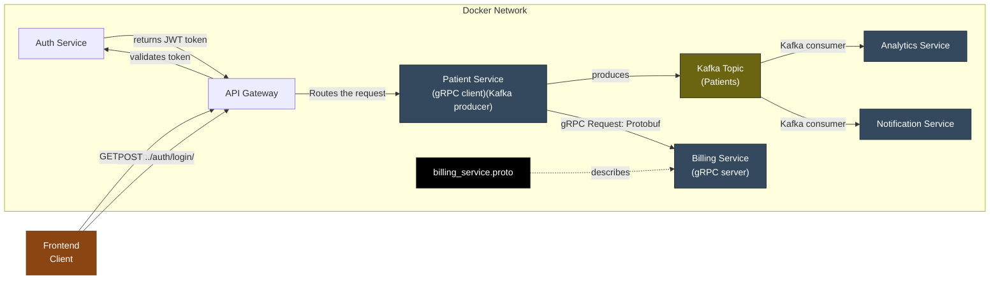

# Java Backend Microservices

## **Overview**
This repository contains my implementation of a production-style Java microservices architecture developed while completing an advanced backend engineering course. Beyond the guided implementation, I extended the project with additional features including Redis caching and pagination, and continue to use it as a sandbox for learning backend architecture and cloud-native development.
## **Architecture**
### Basic CRUD

### gRPC

### Kafka

### API Gateway

### Authentication

## Features

✅ RESTful APIs

✅ Spring Boot

✅ Spring Validation

✅ Global Exception Handling

✅ PostgreSQL

✅ Docker

✅ Docker Compose

✅ JWT Authentication

✅ API Gateway

✅ gRPC

✅ Apache Kafka

✅ Integration Testing

✅ LocalStack

✅ AWS CloudFormation

## Tech Stack

##### Backend

* Java 21
* Spring Boot
* Spring Security
* Spring Validation

##### Communication

* REST
* gRPC
* Kafka

##### Database

PostgreSQL

##### Infrastructure

* Docker
* Docker Compose
* LocalStack
* CloudFormation

##### Testing

* JUnit
* Integration Testing
## Project Structure
* analytics-service/  
* api-requests/  
* billing-service/  
* grpc-requests/   
* integration-tests/  
* patient-service/
* api-gateway/        
* auth-service/  
* infrastructure/
## Getting Started

## Running with Docker

## Future Improvements

## Learning Outcomes